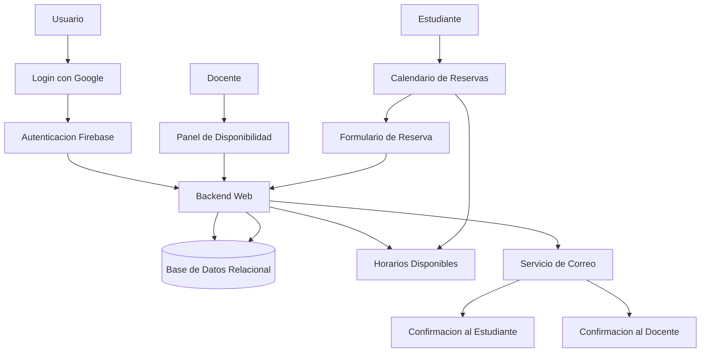
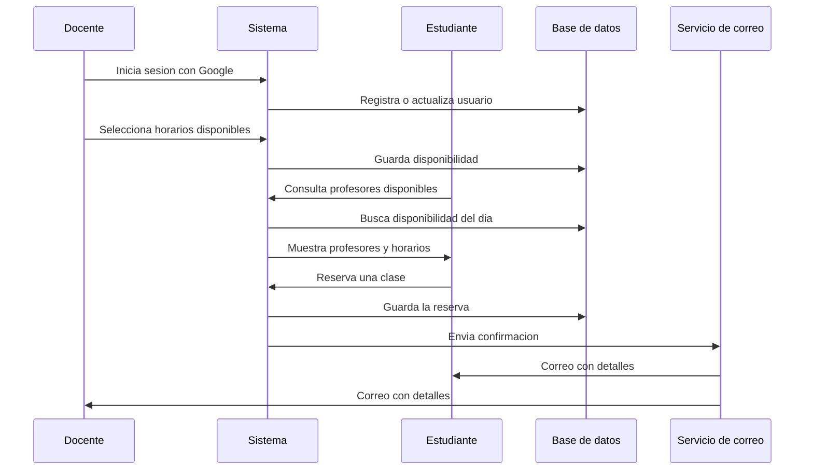
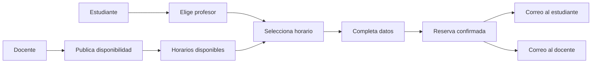

# Plataforma de Reservas para Clases de Inglés

Aplicación web para gestionar reservas de clases de inglés entre estudiantes y docentes. El sistema permite iniciar sesión con Google, registrar usuarios, publicar disponibilidad horaria, reservar clases y enviar confirmaciones automáticas por correo electrónico.

## Objetivo

Facilitar la programación de clases de inglés en línea mediante una plataforma sencilla donde:

- Los docentes pueden iniciar sesión.
- Los docentes pueden publicar su disponibilidad del día.
- Los estudiantes pueden elegir un profesor disponible.
- Los estudiantes pueden reservar una franja horaria.
- El sistema evita reservas en horarios pasados u ocupados.
- Se envían correos de confirmación al estudiante y al docente.
- La reserva incluye datos clave como fecha, hora, nivel, tema y contacto.

## Arquitectura General

## Flujo de Reserva

## Componentes Principales

### Autenticación

El sistema utiliza inicio de sesión con Google mediante Firebase Authentication. Después del login, el backend registra o actualiza la información básica del usuario y mantiene una sesión activa para permitir el acceso al panel de disponibilidad.

### Panel de Disponibilidad

Los docentes pueden seleccionar bloques horarios para el día actual. La disponibilidad se maneja en intervalos de 15 minutos y el sistema bloquea automáticamente horarios pasados o previamente registrados.

### Calendario de Reservas

Los estudiantes pueden consultar profesores disponibles para el día, seleccionar un horario libre y completar un formulario con sus datos personales, nivel de inglés y tema de interés.

### Gestión de Reservas

Cuando un estudiante reserva una clase, el sistema valida la disponibilidad, registra la reserva en la base de datos y marca el horario como ocupado para evitar duplicados.

### Notificaciones por Correo

Después de confirmar la reserva, el sistema envía un correo al estudiante y al docente con los detalles de la clase, incluyendo fecha, hora, nivel, tema y contacto del estudiante.

## Funcionalidades Destacadas

- Login con Google.
- Registro automático de usuarios autenticados.
- Manejo de sesiones.
- Panel para docentes.
- Selección de disponibilidad diaria.
- Horarios en bloques de 15 minutos.
- Bloqueo de horarios pasados.
- Consulta de profesores disponibles.
- Reserva de clases por estudiante.
- Validación contra horarios ocupados.
- Confirmación por correo electrónico.
- Integración con base de datos relacional.
- Diseño web simple y responsivo.

## Habilidades Técnicas Demostradas

- Integración con Firebase Authentication.
- Desarrollo backend con PHP.
- Manejo de sesiones en servidor.
- Integración con base de datos MySQL.
- Uso de consultas preparadas.
- Diseño de flujos de reserva.
- Validación de disponibilidad horaria.
- Prevención de duplicidad en reservas.
- Envío de correos transaccionales.
- Construcción de interfaces web con HTML, CSS y JavaScript.
- Separación entre autenticación, disponibilidad, reservas y notificaciones.

## Modelo Funcional

## Resumen

Este proyecto implementa una plataforma de reservas para clases de inglés, conectando estudiantes y docentes mediante autenticación, disponibilidad horaria, calendario de reservas y confirmaciones automáticas por correo. La aplicación demuestra integración entre frontend, backend, autenticación externa, base de datos y servicios de notificación.
